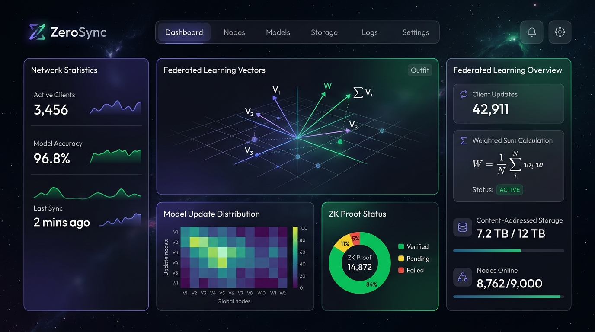

# ZeroSync

A browser-native federated learning setup with a triple-layer privacy stack.

Most federated learning frameworks are heavy. They run on Python, require container orchestration, and need complex setups to run on user devices. ZeroSync works directly in the browser.

More importantly, it implements a real privacy stack. Instead of just promising that your data is safe, it enforces privacy cryptographically.

The triple-layer privacy stack:
1. **Differential Privacy (DP)**: Gaussian or Laplace noise is added to the model weights on the client side before the data leaves the device.
2. **Homomorphic Encryption (HE)**: Built using the Paillier cryptosystem so the aggregator can sum up all model updates while they are still encrypted. The server never sees the raw numbers.
3. **Zero-Knowledge Proofs (ZK)**: We generate PLONK circuits via Circom to prove that the aggregation was done correctly, then verify that proof on-chain using a Solidity smart contract.

If you want to understand how privacy-preserving ML actually works in practice, this is a clean reference implementation.



***

## What is under the hood?

We built a lot of this from scratch to work natively in JavaScript:
* **Zero-dependency Paillier HE**: The entire Paillier cryptosystem (`crypto/paillier.js`) is written in pure JavaScript using `BigInt`. No native C++ bindings or massive WASM blobs are required. It handles key generation, encryption, decryption, and homomorphic addition of signed integers.
* **WebRTC Data Channels**: Clients can talk directly to each other instead of routing everything through the server.
* **Smart Contract Verification**: Proofs are verified on a local Hardhat network (`OnChainVerifier.sol`).
* **Content-Addressed Storage (CAS)**: Model checkpoints and proofs are stored using SHA-256 content addressing.

## How to run it

It is easy to spin up locally.

1. **Install dependencies:**
   ```bash
   npm install
   ```
2. **Start the HTTP server to serve the client UI:**
   ```bash
   npm run start:client
   ```
   Open `http://127.0.0.1:8000` to see the training UI. You can open multiple tabs to simulate multiple clients training on different data.

3. **Start the Signaling and Aggregation Server:**
   ```bash
   npm run start:server
   ```

4. **Run the Homomorphic Encryption demo:**
   ```bash
   npm run he:aggregate
   ```
   This takes the updates from your clients, encrypts them, sums them up homomorphically, decrypts the result, and verifies that it matches the plaintext sum. Open `http://127.0.0.1:8000/dashboard.html` to see the live results.

5. **Run the ZK Proof generation and verification:**
   ```bash
   npm run zk:setup
   npm run zk:prove
   ```

## Why did we build this?

Privacy tech is often fragmented. Blockchain devs know ZK, ML devs know FL, data scientists know DP, and cryptographers know HE. Very few projects put them all together in one system, let alone run them in a browser.

This project is a proof of concept showing that these technologies can be combined into a single, cohesive workflow.

## License

This project is licensed under the **AGPL-3.0 License**.

What this means for you:
* **For individuals, students, or researchers**: Feel free to read the code, fork it, learn from it, and run it.
* **For commercial use**: You are legally required to open-source your entire product under the same license if you use this code. If you want to keep your product closed-source, you will need a commercial license. In that case, reach out directly.

## Contact

Email: astrynnoctra@gmail.com
